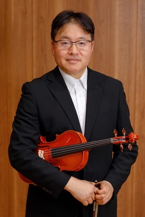
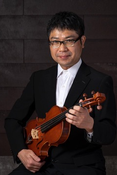

リゾナント弦楽四重奏団（Resonant String Quartet）は、2022年に結成されたアマチュアの弦楽四重奏団です。名古屋を中心に活動していく予定です。

リゾナント（Resonant）とは「反響」「鳴り響く」という意味を持ちます。メンバーの出す音が、聞いてくれる人の心に鳴り響くような演奏を目指していきたいと思います。

---

## 雪上 芳枝(1st violin)

 

(photo by fukuihiroaki)

（プロフィール作成中）

## 石金 よしろう(2nd violin)

 

(photo by hiroaki_ogata)

（プロフィール作成中）

## 中垣 健志(viola)

 

(photo by haruna)

中学１年よりヴィオラを始める。ヴィオラを上坂貴子に師事。大学時代は所属する名古屋大学交響楽団や東海学生オーケストラ連盟のヴィオラトップを務める傍ら、他の大学オーケストラのエキストラとして活動する。社会人になってからは、オストメールフィルハーモニカー／名古屋丸の内交響楽団／名古屋アマデウス室内管弦楽団などのヴィオラトップを務める。また、2011年から2012年にかけて開催された名古屋マーラー音楽祭の主要スタッフとして参加し、参加オーケストラや合唱団との折衝を行った。その後しばらく音楽活動からは遠ざかっていたが、このリゾナント室内管弦楽団で音楽活動を久しぶりに再開することになった。

## 鈴木 裕子(cello)

 (photo by haruna)

（プロフィール作成中）
